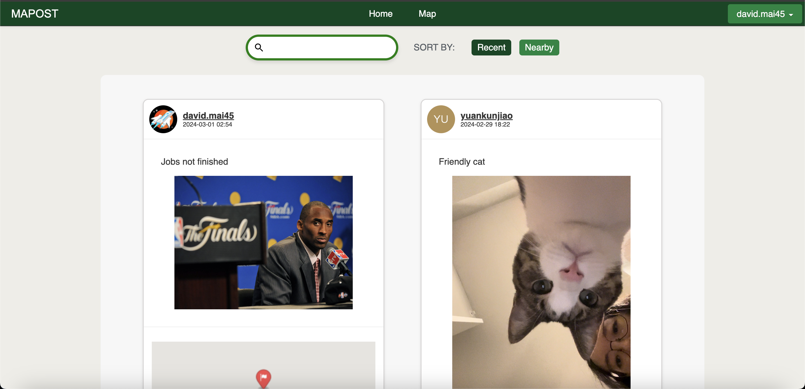
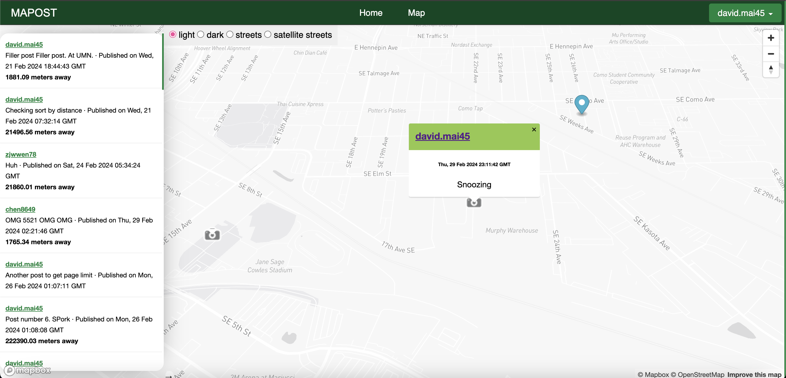
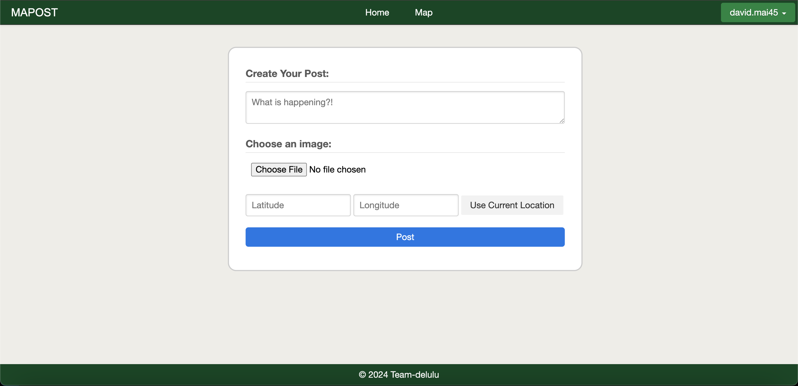
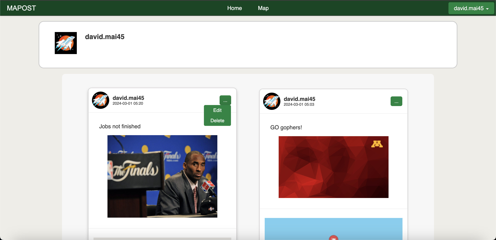

# Module 1 Group Assignment

CSCI 5117, Spring 2024, [assignment description](https://canvas.umn.edu/courses/413159/pages/project-1)

## App Info:

* Team Name: Delulu
* App Name: MAPOST
* App Link: https://delulu-project1.onrender.com/

### Students

* Jimmy Xiao, xiao0261@umn.edu
* David Mai, mai00048@umn.edu
* Lingyi Xu, xu001032@umn.edu
* Hannah Cheng, cheng861@umn.edu
* Yuankun Jiao, jiao0052@umn.edu

## Key Features

**Describe the most challenging features you implemented
(one sentence per bullet, maximum 4 bullets):**

* The map view of posts implemented using Mapbox
* Search bar with a dynamic dropdown for autofilling queries
* Posts feed with persistent sorting and pagination

## Testing Notes

**Is there anything special we need to know in order to effectively test your app? (optional):**

* ...

## Screenshots of Site

### Feed
One of two main ways to view posts. Includes a paginated feed with a search for text content and a recent/nearby sort.

### Map
One of two main ways to view posts. Includes 4 different map styles and an interactive sidebar feed to go to a post on the map. Has a marker showing current position.

### Create
Creation page for a user post. Includes text, image, and coordinate(number) input. Able to use current location to autofill coordinates.

### User
A user's page which shows a paginated feed of their posts ordered by recency. If it's your page, an additional button appears for edit and delete abilities.

## Mock-up 
Press Pages to view other pages:

https://app.moqups.com/65yuGy0ywLlNvmH97f7BkrxYrhJ9mT42/view/page/a4dc19d87

## External Dependencies

**Document integrations with 3rd Party code or services here.
Please do not document required libraries. or libraries that are mentioned in the product requirements**

* Library or service name: description of use
* Mapbox: Used Mapbox to make and integrate the posts map display

**If there's anything else you would like to disclose about how your project
relied on external code, expertise, or anything else, please disclose that
here:**

...
